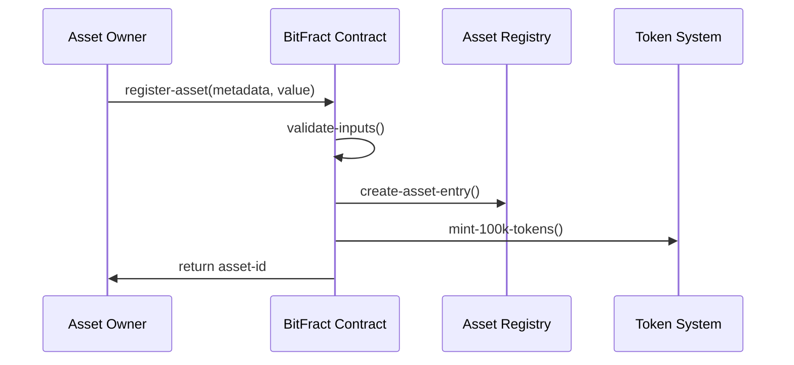
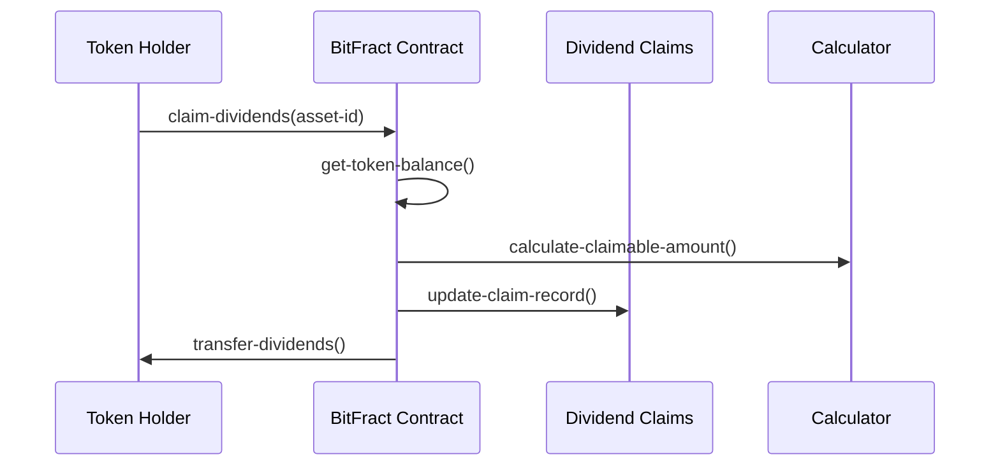
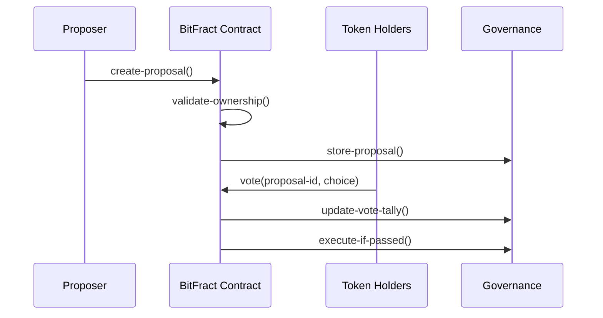

# BitFract Protocol

## Decentralized Real-World Asset Tokenization on Bitcoin

[](https://stacks.co)
[](https://bitcoin.org)
[](https://github.com/bitfract/protocol)

## Overview

BitFract is a comprehensive Bitcoin-secured platform for tokenizing, trading, and governing real-world assets through fractional ownership. Built on Stacks Layer 2, BitFract transforms traditional illiquid assets into liquid, tradeable Bitcoin-backed tokens while maintaining regulatory compliance and enabling decentralized governance.

### Key Features

- **🏗️ Asset Tokenization**: Convert real-world assets into 100,000 fractional SFTs
- **💰 Automated Dividends**: Proportional yield distribution to token holders
- **🛡️ KYC/AML Compliance**: Multi-level verification system
- **🗳️ Decentralized Governance**: Token-weighted proposal voting
- **📊 Oracle Integration**: Real-time asset pricing and valuation
- **🔐 Bitcoin Security**: Immutable settlement on Bitcoin blockchain

## System Architecture

### High-Level Architecture

```
┌─────────────────┐    ┌─────────────────┐    ┌─────────────────┐
│   Real World    │    │   BitFract      │    │   Bitcoin       │
│   Assets        ├────┤   Protocol      ├────┤   Blockchain    │
│                 │    │   (Stacks L2)   │    │   (Settlement)  │
└─────────────────┘    └─────────────────┘    └─────────────────┘
         │                       │                       │
         │                       │                       │
    ┌────▼────┐              ┌───▼───┐              ┌────▼────┐
    │ Asset   │              │ Smart │              │ Proof   │
    │ Registry│              │Contract│              │ of Work │
    └─────────┘              └───────┘              └─────────┘
```

### Contract Architecture

```
BitFract Smart Contract
├── Asset Management Layer
│   ├── Asset Registry (assets)
│   ├── Token Balances (token-balances)
│   └── Price Feeds (price-feeds)
│
├── Compliance Layer
│   ├── KYC Registry (kyc-status)
│   └── Validation Functions
│
├── Governance Layer
│   ├── Proposals (proposals)
│   ├── Voting System (votes)
│   └── Execution Engine
│
└── Financial Layer
    ├── Dividend Distribution (dividend-claims)
    └── Yield Calculation Engine
```

## Data Flow

### Asset Tokenization Flow



### Dividend Distribution Flow



### Governance Voting Flow



## Core Components

### Asset Registry

Central repository for all tokenized assets with comprehensive metadata:

- Asset ownership and control
- Valuation and pricing history
- Lock status and trading permissions
- Creation timestamps and audit trail

### Token Management

Fractional ownership system with standardized tokenization:

- **Standard Fractionalization**: 100,000 SFTs per asset
- **Balance Tracking**: Multi-asset portfolio management
- **Transfer Controls**: Compliance-aware token transfers

### Compliance Engine

Multi-layered KYC/AML system:

- **Verification Levels**: 5-tier compliance structure
- **Expiry Management**: Time-based verification renewal
- **Access Controls**: Compliance-gated functionality

### Governance Framework

Decentralized decision-making system:

- **Proposal Creation**: Minimum ownership requirements
- **Token-Weighted Voting**: Proportional representation
- **Execution Engine**: Automated proposal implementation

### Financial Infrastructure

Automated yield distribution:

- **Dividend Calculation**: Proportional to token ownership
- **Anti-Double-Claim**: Prevents duplicate distributions
- **Yield Tracking**: Comprehensive distribution history

## Technical Specifications

### Smart Contract Details

- **Language**: Clarity (Stacks native)
- **Network**: Stacks Mainnet/Testnet
- **Settlement**: Bitcoin blockchain finality
- **Token Standard**: Semi-Fungible Tokens (SFTs)

### Configuration Limits

```clarity
MAX-ASSET-VALUE: 1,000,000,000,000 satoshis
MIN-ASSET-VALUE: 1,000 satoshis
MAX-VOTING-DURATION: 144 blocks (~1 day)
MIN-VOTING-DURATION: 12 blocks (~1 hour)
TOKENS-PER-ASSET: 100,000 SFTs
```

### Security Features

- **Owner-Only Registration**: Asset creation restricted to contract owner
- **Input Validation**: Comprehensive parameter checking
- **Overflow Protection**: Safe arithmetic operations
- **Access Controls**: Function-level permission system

## Getting Started

### Prerequisites

- Stacks CLI or compatible wallet
- STX tokens for transaction fees
- KYC verification (for compliance features)

### Deployment

```bash
# Clone repository
git clone https://github.com/bitfract/protocol
cd bitfract-protocol

# Deploy to testnet
stacks-cli deploy --network testnet --contract-file bitfract.clar

# Deploy to mainnet
stacks-cli deploy --network mainnet --contract-file bitfract.clar
```

### Basic Usage

#### Register New Asset

```clarity
(contract-call? .bitfract register-asset 
  "ipfs://Qm...metadata" 
  u50000000)  ;; 500k satoshis
```

#### Check Token Balance

```clarity
(contract-call? .bitfract get-balance 
  'SP1ABC... ;; owner address
  u1)        ;; asset-id
```

#### Claim Dividends

```clarity
(contract-call? .bitfract claim-dividends u1)
```

#### Create Governance Proposal

```clarity
(contract-call? .bitfract create-proposal
  u1                           ;; asset-id
  "Proposal: Asset Upgrade"    ;; title
  u72                          ;; duration (12 hours)
  u10000)                      ;; minimum votes
```

## API Reference

### Public Functions

| Function | Parameters | Description |
|----------|------------|-------------|
| `register-asset` | `metadata-uri`, `asset-value` | Tokenize new real-world asset |
| `claim-dividends` | `asset-id` | Claim proportional dividend share |
| `create-proposal` | `asset-id`, `title`, `duration`, `min-votes` | Create governance proposal |
| `vote` | `proposal-id`, `vote-for`, `amount` | Vote on governance proposal |

### Read-Only Functions

| Function | Parameters | Returns | Description |
|----------|------------|---------|-------------|
| `get-asset-info` | `asset-id` | Asset details | Complete asset information |
| `get-balance` | `owner`, `asset-id` | Token balance | User's token holdings |
| `get-proposal` | `proposal-id` | Proposal details | Governance proposal info |
| `get-vote` | `proposal-id`, `voter` | Vote details | Individual vote information |

## Roadmap

### Phase 1: Core Infrastructure ✅

- [x] Asset tokenization engine
- [x] Dividend distribution system
- [x] Basic governance framework
- [x] KYC compliance integration

### Phase 2: Advanced Features 🚧

- [ ] Cross-chain asset bridging
- [ ] Advanced oracle integration
- [ ] Institutional yield products
- [ ] Mobile wallet integration

### Phase 3: Ecosystem Expansion 📋

- [ ] DeFi protocol integrations
- [ ] Secondary market DEX
- [ ] Asset management tools
- [ ] Institutional custody solutions

## Contributing

We welcome contributions from the community! Please see our [Contributing Guidelines](CONTRIBUTING.md) for details on:

- Code standards and style
- Pull request process
- Issue reporting
- Security considerations
